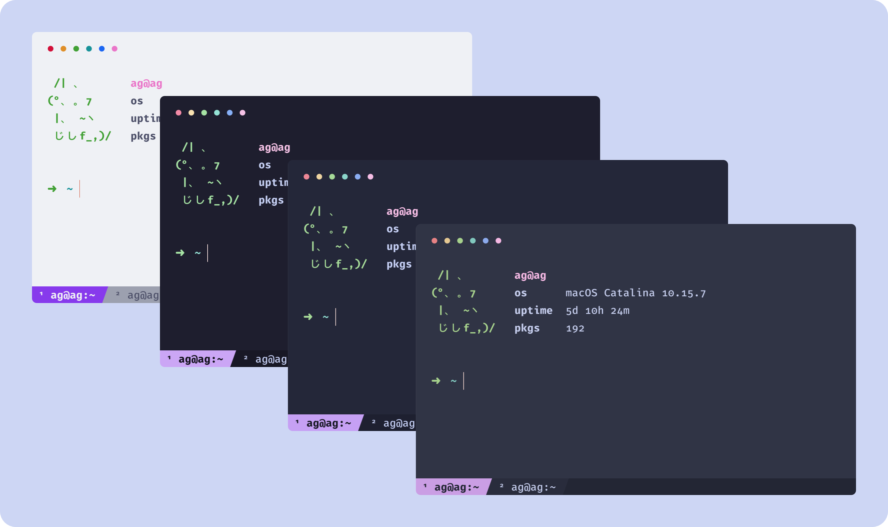

<h3 align="center">
	 
	
	Catppuccin for Kitty
	
</h3>

    
    
    

  

## Usage

1. Choose your flavour.
2. Copy the contents of _flavour_.conf into your kitty config file (usually stored at `~/.config/kitty/kitty.conf`)
3. Save and enjoy!

Alternatively copy all flavour configs into your kitty theme directory (usually `~/.config/kitty/themes/`) and then use the themes kitten to select your desired flavour. `kitty +kitten themes --reload-in=all <optional: Theme Name>` (_Catppuccin-Latte, Catppuccin-Frappe, Catppuccin-Macchiato, Catppuccin-Mocha_)

## 💝 Thanks to

-   [Pocco81](https://github.com/Pocco81)
-   [Lokesh Krishna](https://github.com/lokesh-krishna)
-   [Andreas Grafen](https://github.com/andreasgrafen)

&nbsp;

Copyright &copy; 2020-present <a href="https://github.com/catppuccin" target="_blank">Catppuccin Org</a>

