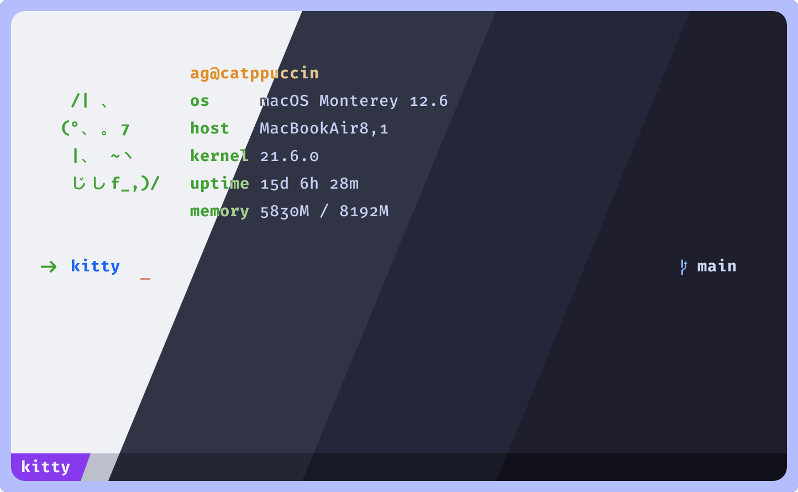
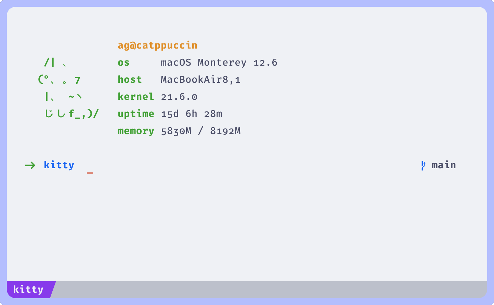
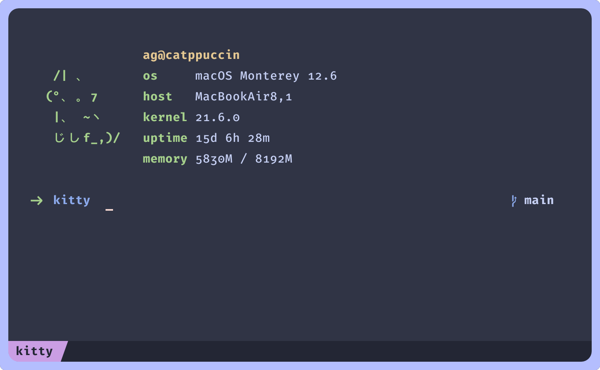
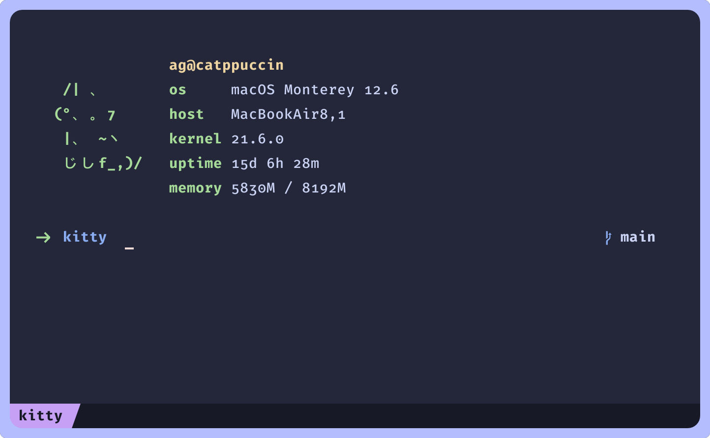
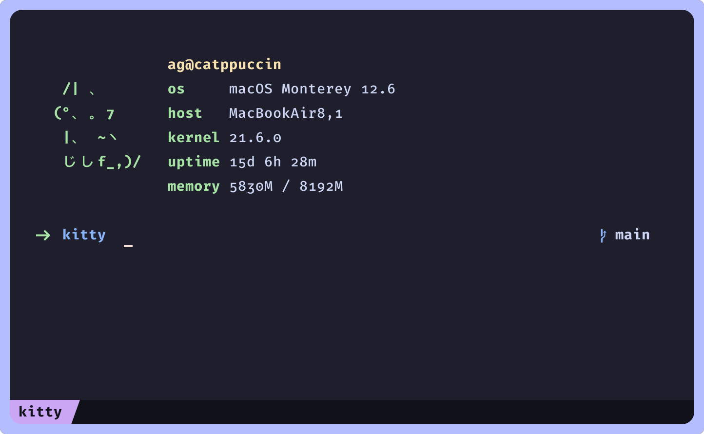

<h3 align="center">
	<br/>
	
	Catppuccin for <a href="https://github.com/kovidgoyal/kitty">Kitty</a>
	
</h3>

<p align="center">
    <a href="https://github.com/catppuccin/kitty/stargazers"></a>
    <a href="https://github.com/catppuccin/kitty/issues"></a>
    <a href="https://github.com/catppuccin/kitty/contributors"></a>
</p>

<p align="center">
	
</p>

## Previews

<details>
<summary>🌻 Latte</summary>

</details>
<details>
<summary>🪴 Frappé</summary>

</details>
<details>
<summary>🌺 Macchiato</summary>

</details>
<details>
<summary>🌿 Mocha</summary>

</details>

## Usage

> [!TIP]
> If you're using Kitty `>0.26.0`, all Catppuccin flavors are already included in Kitty! There's no need to install the base theme.

1. Copy the contents of your preferred flavor from [`themes/`](./themes/) into your [kitty configuration file](https://sw.kovidgoyal.net/kitty/conf/) (usually `~/.config/kitty/kitty.conf`).
3. Save and enjoy!

Alternatively you can copy all flavor configs into your [kitty theme directory](https://sw.kovidgoyal.net/kitty/kittens/themes/#using-your-own-themes) (usually `~/.config/kitty/themes/`), and then use the themes kitten to select your desired flavor:

```
kitty +kitten themes --reload-in=all <optional: theme name>
```

`Catppuccin-Latte`, `Catppuccin-Frappe`, `Catppuccin-Macchiato`, `Catppuccin-Mocha` are their respective names.

## 🙋 FAQ

- Q: **_"How can I style the tab bar like the screenshots?"_** \
  A: The config settings for the tab bar are the following:

  ```ini
  tab_bar_min_tabs            1
  tab_bar_edge                bottom
  tab_bar_style               powerline
  tab_powerline_style         slanted
  tab_title_template          {title}{' :{}:'.format(num_windows) if num_windows > 1 else ''}
  ```

- Q: **_"What font is used in the screenshots?"_** \
  A: The font used in the screenshots is [Fira Code](https://github.com/tonsky/FiraCode). The following stylistic alternatives and ligatures are set:

  ```ini
  +cv02 +cv05 +cv09 +cv14 +ss04 +cv16 +cv31 +cv25 +cv26 +cv32 +cv28 +ss10 +zero +onum
  ```

- Q: **_"Which fetch is used in the screenshots?"_** \
  A: It's [pfetch with kitties](https://github.com/andreasgrafen/pfetch-with-kitties) — a slightly modified version of [pfetch](https://github.com/dylanaraps/pfetch) which adds the ASCII Kitty.

## 💝 Thanks to

- [Pocco81](https://github.com/Pocco81)
- [Lokesh Krishna](https://github.com/lokesh-krishna)
- [Andreas Grafen](https://github.com/andreasgrafen)

&nbsp;

<p align="center"></p>
<p align="center">Copyright &copy; 2021-present <a href="https://github.com/catppuccin" target="_blank">Catppuccin Org</a>
<p align="center"><a href="https://github.com/catppuccin/catppuccin/blob/main/LICENSE"></a></p>
